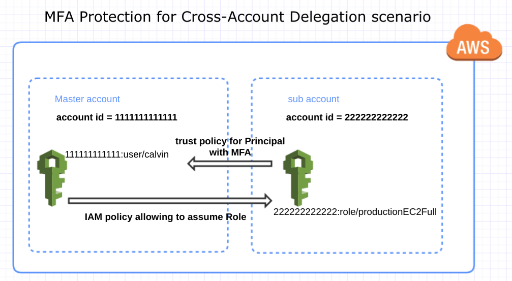

# Motivation

[awscli](https://pypi.org/project/awscli/) stores its credentials by default in plaintext in `~/.aws/credentials`. By using  [aws-vault](https://github.com/99designs/aws-vault) we can store them encrypted in a file or in a keyring. The invocation now looks like this:

```bash
$ aws-vault --prompt=terminal exec calvin -- env
Enter passphrase to unlock /home/yoda/.awsvault/keys/: ______
..snipped..
```

Following best practices, we add an iam-policy to enforce MFA (Virtual MFA) for all IAM users. This forces `aws-vault` to prompt for the token.

```bash
$ aws-vault --prompt=terminal exec calvin -- env
Enter passphrase to unlock /home/yoda/.awsvault/keys/: ______
Enter token for arn:aws:iam::111111111111:mfa/calvin: 890980
..snipped..
```

All looks good. Now we want to run `terraform` via `aws-vault`. The aws provider has an `assume_role` section that looks promising. 

```HCL
provider "aws" {
  assume_role {
    role_arn     = "arn:aws:iam::ACCOUNT_ID:role/ROLE_NAME"
  }
}
```

Unfortunately this does not work. And here are the tickets submitted open for this problem.

* [#472](https://github.com/terraform-providers/terraform-provider-aws/issues/472)
* [#2420](https://github.com/terraform-providers/terraform-provider-aws/issues/2420)
* [#5078](https://github.com/terraform-providers/terraform-provider-aws/issues/5078)

# Scenario

This is the scenario that we will discuss my solution.



For the IAM role `productionEC2Full`, its trust policy which demands the presence of MFA looks like this:

```JSON
{
  "Version": "2012-10-17",
  "Statement": [
    {
      "Effect": "Allow",
      "Principal": {
        "AWS": [
          "arn:aws:iam::111111111111:user/calvin"
        ]
      },
      "Action": "sts:AssumeRole",
      "Condition": {
        "Bool": {
          "aws:MultiFactorAuthPresent": "true"
        }
      }
    }
  ]
}
```

The IAM user in the master account `calvin` is assigned the policy to assume the target role.

```JSON
{
  "Version": "2012-10-17",
  "Statement": [{
    "Effect": "Allow",
    "Action": "sts:AssumeRole",
    "Resource": "arn:aws:iam::222222222222:role/productionEC2Full"
  }]
}
```

# Solution

It is assumed that a `calvin` profile has been created via `aws-vault`:

```bash
[profile calvin]
output = json
region = us-east-2
role_arn = arn:aws:iam::222222222222:role/productionEC2Full
mfa_serial = arn:aws:iam::111111111111:mfa/calvin
```

Thus, we will not use terraform's `assume_role` section to indicate what role to assume. That job is left to `aws-vault`
and it will pass the following environment variables to terraform


```bash
AWS_VAULT=calvin
AWS_DEFAULT_REGION=us-east-2
AWS_REGION=us-east-2
AWS_ACCESS_KEY_ID=ASIA************
AWS_SECRET_ACCESS_KEY=Vcga********
AWS_SESSION_TOKEN=FQo*************
AWS_SECURITY_TOKEN=FQo************
```

The AWS provider is then simplified to:

```HCL
provider "aws" {
  region   = "${var.aws_region}"
}
```

To ensure that you are indeed executing under a specific profile, create a `Makefile` to simplify your life.

```bash
VAULT := /home/yoda/gopath/bin
TERRAFORM := /home/yoda/bin
PROFILE ?= calvin
TF := TF_LOG=DEBUG $(VAULT)/aws-vault --prompt=terminal exec $(PROFILE) -- $(TERRAFORM)/terraform

.PHONY: plan
plan:
        $(TF) plan 

.PHONY: apply
apply:
        $(TF) apply

.PHONY: destroy
destroy:
        $(TF) destroy
```
